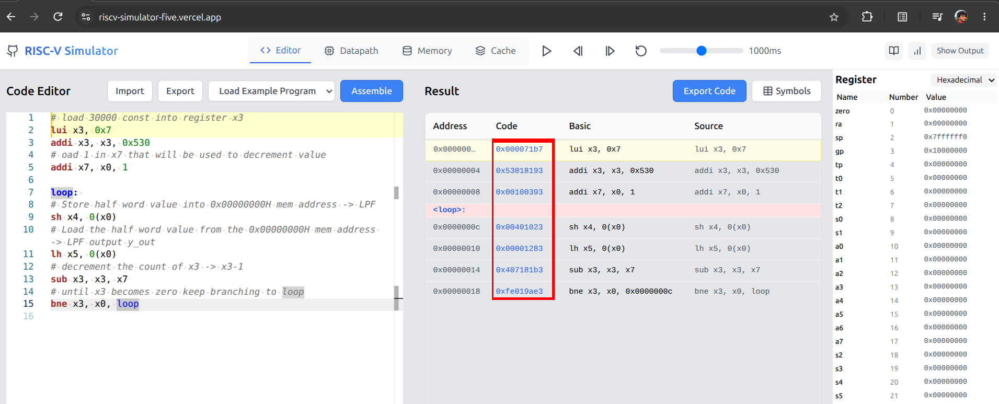
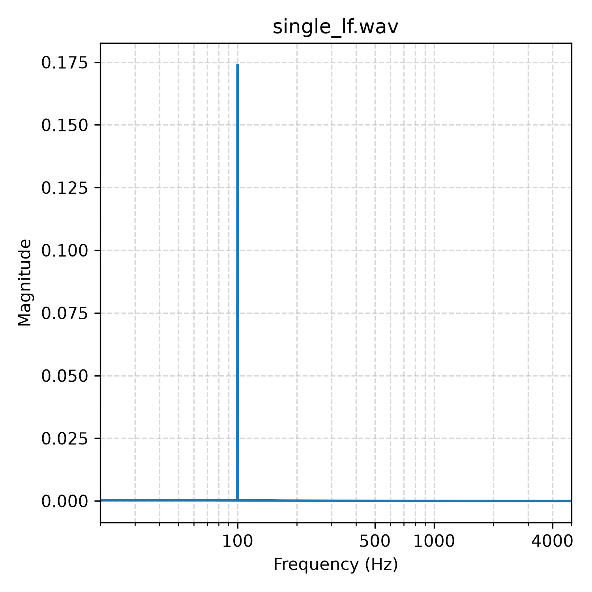

# RISC-V Low-Pass Filter Accelerator

This project implements a second-order Butterworth low-pass filter as a hardware
accelerator for a 32-bit single-cycle RISC-V processor. The processor sends
16-bit PCM samples to the accelerator through memory-mapped I/O (MMIO), and the
accelerator returns the filtered samples.

The design uses the RV32I integer subset, fixed-point coefficients, parallel
multiply-accumulate hardware, and delay registers. The filter is mapped at
`0x00000000`.

## Contents

- [Overview](#overview)
- [Input and output results](#input-and-output-results)
- [Filter design](#filter-design)
    - [Sampling and Nyquist limit](#sampling-and-nyquist-limit)
    - [Analog prototype and pole selection](#analog-prototype-and-pole-selection)
    - [Frequency scaling and pre-warping](#frequency-scaling-and-pre-warping)
    - [Bilinear transformation](#bilinear-transformation)
    - [Difference equation](#difference-equation)
    - [Direct Form I](#direct-form-i)
- [Fixed-point Verilog implementation](#fixed-point-verilog-implementation)
- [Running the tests](#running-the-tests)
- [RISC-V and MMIO integration](#risc-v-and-mmio-integration)
    - [Finding RISC-V machine code](#finding-risc-v-machine-code)
- [Performance](#performance)
- [Planned improvements](#planned-improvements)
- [References](#references)

## Overview

The accelerator performs the filter's multiply-accumulate operation in parallel
instead of executing the complete difference equation as a sequence of CPU
instructions. The processor remains responsible for control and sample transfer.

The single-cycle RISC-V processor used in this project follows the design
principles covered in the [[4]](#reference-4).

### 2nd Order Butterworth Low Pass Filter


### Single-cycle RISC-V Processor with LPF accelerator


The DigitalJS diagrams include a few extra wires and registers to make internal
signals such as the ALU result and program counter visible during simulation.

## Input and output results

The example input is a 3-second, 16-bit PCM signal generated with SciPy. It
contains 100 Hz and 4,000 Hz sine waves. The 4,000 Hz component is intentionally
included so that the low-pass behavior is easy to observe.

**Hearing warning: the input contains a 4,000 Hz tone.**
(Note: I converted the wav into mp4 using ffmpeg so it'd be easier to show in readme markdown)
- Input signal

https://github.com/user-attachments/assets/da812555-eda7-4a3b-aa57-20f6f05ca55a

- Python-filtered output

https://github.com/user-attachments/assets/1bf2b3b9-f98f-4fc8-accc-5338da5ace6d

- Verilog-filtered output

https://github.com/user-attachments/assets/c2acd90c-50c1-4719-ba5c-3ec40075e909

The input spectrum contains both tones, while the filtered output retains the
100 Hz component:


The repository also contains the generated WAV and plot files under `audios/`
and `media/`.

## Designing a 2nd Order Butterworth Low Pass Filter

I started with a random design problem. I want to design a butterworth low pass filter. I will use two superimposed signals for testing 100Hz and 4000Hz, so my lpf should have cut off frequency at 100Hz.

The target is a second-order Butterworth low-pass filter with a 100 Hz cutoff
and a 10,000 Hz sampling frequency. The derivation below produces the digital
biquad coefficients used by the Verilog implementation.

### Sampling and Nyquist limit

The sampling frequency must be greater than twice the highest input frequency:

$$f_s > 2 f_{\max}$$

The highest test tone is 4,000 Hz, so a sampling frequency above 8,000 Hz is
required. The design uses $f_s = 10,000\text{ Hz}$, keeping the test tone below
the Nyquist limit. A 5,000 Hz test tone was avoided because it lies exactly at
the Nyquist frequency.

### Analog prototype and pole selection

A Butterworth filter is defined by having a maximally flat magnitude response in the passband. The magnitude squared response for a normalized analog Butterworth filter ($\Omega_c = 1\text{ rad/s}$) is:

$$|H(j\Omega)|^2 = \frac{1}{1 + \Omega^{2N}}$$

Evaluating the response along the imaginary axis ($\Omega^2 = -s^2$) for an order of $N=2$ yields the s-domain relationship:

$$H(s) \cdot H(-s) = \frac{1}{1 + (-s^2)^2} = \frac{1}{1 + s^4}$$

Set the denominator polynomial to zero ($1 + s^4 = 0$) to locate the system's characteristic poles. Using Euler's identity, $e^{j\theta} = \cos\theta + j\sin\theta$, and noting that $-1 = e^{j(\pi + 2k\pi)}$, we set up the equation for the poles:

$$s^4 = e^{j(\pi + 2k\pi)}$$

Taking the 4th root (raising both sides to the power of $1/4$) divides the exponent's angle by 4:

$$s_k = \left(e^{j(\pi + 2k\pi)}\right)^{1/4} = e^{j\frac{\pi + 2k\pi}{4}} \quad \text{for } k = 0, 1, 2, 3$$

Evaluating this for each $k$ gives our four complex poles:
*   $s_0 = \frac{1}{\sqrt{2}} + j\frac{1}{\sqrt{2}}$
*   $s_1 = -\frac{1}{\sqrt{2}} + j\frac{1}{\sqrt{2}}$
*   $s_2 = -\frac{1}{\sqrt{2}} - j\frac{1}{\sqrt{2}}$
*   $s_3 = \frac{1}{\sqrt{2}} - j\frac{1}{\sqrt{2}}$

#### Plotting the Poles in the s-plane
- 

To ensure system stability, all poles of $H(s)$ must lie strictly in the left-half of the s-plane. Selecting stable poles $s_1$ and $s_2$ allows us to construct the normalized analog transfer function $H_n(s)$:

$$H_n(s) = \frac{1}{(s - s_1)(s - s_2)}$$

Substituting the values of $s_1$ and $s_2$:

$$H_n(s) = \frac{1}{\left[s - \left(-\frac{1}{\sqrt{2}} + j\frac{1}{\sqrt{2}}\right)\right]\left[s - \left(-\frac{1}{\sqrt{2}} - j\frac{1}{\sqrt{2}}\right)\right]}$$

Expanding this difference of squares yields the normalized prototype:

$$H_n(s) = \frac{1}{s^2 + \sqrt{2}s + 1}$$

### Frequency scaling

To scale to the desired cutoff frequency $\Omega_p$, we substitute $s \to \frac{s}{\Omega_p}$. 

$$H_a(s) = \frac{1}{\left(\frac{s}{\Omega_p}\right)^2 + \sqrt{2}\left(\frac{s}{\Omega_p}\right) + 1}$$

Multiplying the numerator and denominator by $\Omega_p^2$ gives:

$$H_a(s) = \frac{\Omega_p^2}{s^2 + \sqrt{2}\Omega_p s + \Omega_p^2}$$

### Frequency scaling and pre-warping

The pre-warping relationship used here follows the frequency-pre-warping reference in [[2]](#reference-2).

*(Note: As our end goal is to process audio in a digital/binary system, we are talking about digital frequency here).*

The frequency relationship in the analog <--> digital domain is non-linear, so we need to perform frequency pre-warping. Calculate equivalent analog frequency as per the given digital frequency specs.

$$\Omega_p = \frac{2}{T} \tan\left(\frac{\omega_c}{2}\right)$$

Given our sampling frequency $f_s = 10,000\text{ Hz}$:
*   $T = \frac{1}{f_s} = 10^{-4}\text{ s}$
*   $\omega_c = 2\pi \frac{f_c}{f_s} = 2\pi \frac{100}{10000} = 0.02\pi$

$$\Omega_p = \frac{2}{10^{-4}} \tan\left(\frac{0.02\pi}{2}\right) = 2 \cdot 10^4 \tan(0.01\pi)$$

As equations get dirty if we replace with numerical values, let $K = \frac{2}{T} = 2 \cdot 10^4$. 
So, $\Omega_p = K \tan(0.01\pi)$.

Replacing the value of $\Omega_p$ in the un-normalized transfer function $H_a(s)$ yields:

$$H_a(s) = \frac{K^2 \tan^2(0.01\pi)}{s^2 + \sqrt{2}s K \tan(0.01\pi) + K^2 \tan^2(0.01\pi)}$$

Dividing the numerator and denominator by $K^2 \tan^2(0.01\pi)$ formats it perfectly for the next step:

$$H_a(s) = \frac{1}{\frac{1}{K^2 \tan^2(0.01\pi)}s^2 + \frac{\sqrt{2}}{K\tan(0.01\pi)}s + 1}$$

### Bilinear transformation

The bilinear transformation used to map the analog filter into the digital domain follows [[1]](#reference-1).

The Bilinear Transformation maps the analog s-plane to the discrete z-plane using the substitution:
$$s = \frac{2}{T}\left(\frac{1 - z^{-1}}{1 + z^{-1}}\right)$$

As $\frac{2}{T} = 2 \cdot 10^4$, which we have assumed to be $K$ earlier, this becomes:
$$s = K \left( \frac{1 - z^{-1}}{1 + z^{-1}} \right)$$

Now, replace $s$ with $z$ in the analog transfer function $H_a(s)$:

$$H(z) = \frac{1}{\frac{1}{K^2 \tan^2(0.01\pi)} \left[K \left(\frac{1 - z^{-1}}{1 + z^{-1}}\right)\right]^2 + \frac{\sqrt{2}}{K \tan(0.01\pi)} \left[K \left(\frac{1 - z^{-1}}{1 + z^{-1}}\right)\right] + 1}$$

Notice how the $K$ terms completely cancel out algebraically:

$$H(z) = \frac{1}{\frac{K^2}{K^2 \tan^2(0.01\pi)} \left(\frac{1 - z^{-1}}{1 + z^{-1}}\right)^2 + \frac{\sqrt{2}K}{K \tan(0.01\pi)} \left(\frac{1 - z^{-1}}{1 + z^{-1}}\right) + 1}$$

$$H(z) = \frac{1}{\frac{1}{\tan^2(0.01\pi)} \left(\frac{1 - z^{-1}}{1 + z^{-1}}\right)^2 + \frac{\sqrt{2}}{\tan(0.01\pi)} \left(\frac{1 - z^{-1}}{1 + z^{-1}}\right) + 1}$$

Because $\frac{1}{\tan(\theta)} = \cot(\theta)$, we can simplify the equation by letting $A = \cot(0.01\pi) \approx 31.820516$. We can represent the transfer function again as:

$$H(z) = \frac{1}{A^2 \left[ \frac{1 - z^{-1}}{1 + z^{-1}} \right]^2 + \sqrt{2} A \left[ \frac{1 - z^{-1}}{1 + z^{-1}} \right] + 1}$$

Multiplying the numerator and denominator by $(1 + z^{-1})^2$ gives:

$$H(z) = \frac{(1 + z^{-1})^2}{A^2(1 - z^{-1})^2 + \sqrt{2}A(1 - z^{-1})(1 + z^{-1}) + (1 + z^{-1})^2}$$

Expanding the binomials in the denominator and grouping by powers of $z$ produces the structured transfer function:

$$H(z) = \frac{1 + 2z^{-1} + z^{-2}}{(A^2 + \sqrt{2}A + 1) + 2(1 - A^2)z^{-1} + (A^2 - \sqrt{2}A + 1)z^{-2}}$$

### Difference equation

To map this to standard Biquad form, we divide all terms by the constant denominator factor $D_0 = (A^2 + \sqrt{2}A + 1)$ to normalize $a_0$ to $1$. We need to map the transfer function as:

$$H(z) = \frac{Y(z)}{X(z)} = \frac{b_0 + b_1 z^{-1} + b_2 z^{-2}}{1 + a_1 z^{-1} + a_2 z^{-2}}$$

Using $A = \cot(0.01 \pi) = 31.820516$, the constants resolve to:

*   **$A^2$** $= 1012.5452$
*   **$\sqrt{2}A$** $= 45.0010$
*   **$D_0$** $= A^2 + \sqrt{2}A + 1 = 1058.5462$
*   **$z^{-1}$ numerator ($D_1$)** $= 2(1 - A^2) = -2023.0904$
*   **$z^{-2}$ numerator ($D_2$)** $= A^2 - \sqrt{2}A + 1 = 968.5442$

Dividing by $D_0$ gives the final filter coefficients:

*   $b_0 = \frac{1}{1058.5462} = 0.00094469$
*   $b_1 = \frac{2}{1058.5462} = 0.00188932$
*   $b_2 = \frac{1}{1058.5462} = 0.00094469$
*   $a_1 = \frac{-2023.0904}{1058.5462} = -1.911197$
*   $a_2 = \frac{968.5442}{1058.5462} = 0.914975$

Now, applying the Inverse Z-Transform directly to $H(z)$ extracts the time-domain difference equation (Direct Form I) for hardware implementation:

*(Note: I am not replacing coefficients here as it will be dirty, but they remain as variables ready for hardware)*

$$Y(z) [1 + a_1 z^{-1} + a_2 z^{-2}] = X(z) [b_0 + b_1 z^{-1} + b_2 z^{-2}]$$

$$y[n] + a_1 y[n-1] + a_2 y[n-2] = b_0 x[n] + b_1 x[n-1] + b_2 x[n-2]$$

$$y[n] = b_0 x[n] + b_1 x[n-1] + b_2 x[n-2] - a_1 y[n-1] - a_2 y[n-2]$$

### Direct Form I

The Direct Form I structure is shown below. [[9]](#reference-9)


## Fixed-point Verilog implementation

Because our processor implements a subset of the RV32I base integer instruction set, it lacks native floating-point hardware support. To solve this, we will use fixed-point numbers.

The RV32I instruction-set context is described by the RISC-V reference card in [[3]](#reference-3). The fixed-point representation and Q-format terminology follow [[5]](#reference-5).

Checking the filter coefficients, we observe the following extremes:
*   **Maximum positive value:** $+0.914975$
*   **Maximum negative value:** $-1.911197$

To represent these in a 16-bit register, a Q2.14 fixed-point format is sufficient.
A signed Q2.14 format consists of 1 sign bit, 1 integer bit, and 14 fractional bits. This provides a representable range from a minimum of $-2.0$ (binary `10.0000 0000 0000 00`) to a maximum of $+1.99993896...$ (binary `01.1111 1111 1111 11`). Since our coefficients strictly fall within the $[-2.0, +1.9999]$ boundary, this format perfectly covers our required range without overflow.

*   **Precision (Step Size):** $2^{-14} = \frac{1}{16384} \approx 0.000061035$

To convert a coefficient to this integer format, we multiply by the scaling factor $2^{14} = 16384$. We are essentially finding how many LSB steps of size $\frac{1}{16384}$ are needed to build the target value. For example, building $0.914975$:

$$
\mathrm{Count} = \dfrac{\mathrm{Target Value}}{\mathrm{LSB Step Size}} = \dfrac{0.914975}{2^{-14}} = 0.914975 \cdot 16384 \approx 14991
$$


$14991$ in decimal corresponds to Q2.14 binary `00.11101010001111`. When reconstructed, $\frac{14991}{16384} = 0.9149780273$. Note that the reconstructed value is slightly greater because we rounded $14990.95$ to $14991$. We must understand that fixed-point representation may not be exact due to quantization error. When designing filters, we must ensure the quantized coefficients still produce a stable response, otherwise, the filter may oscillate or fail entirely.

Multiplying each coefficient by $2^{14} = 16384$ and rounding yields:
*   $b_0 = 0.00094469 \times 16384 \approx 15$
*   $b_1 = 0.00188938 \times 16384 \approx 31$
*   $b_2 = 0.00094469 \times 16384 \approx 15$
*   $a_1 = -1.911197 \times 16384 \approx -31313$
*   $a_2 = 0.914976 \times 16384 \approx 14991$

Our difference equation requires subtracting the feedback terms: $-a_1 y[n-1] - a_2 y[n-2]$. To optimize our hardware and use a pure adder tree, we can convert these coefficients beforehand by storing their negated (2's complement) forms. This eliminates subtraction operations in Verilog.

*   **For $-a_1$:** $-(-31313) = +31313$. No 2's complement conversion needed, store directly as positive.
*   **For $-a_2$:** $-(+14991) = -14991$. Convert into 16-bit 2's complement:
    * `1100 0101 0111 0001`

```verilog
    localparam signed [15:0] b0 = 16'sb0000000000001111; // 15
    localparam signed [15:0] b1 = 16'sb0000000000011111; // 31
    localparam signed [15:0] b2 = 16'sb0000000000001111; // 15
    localparam signed [15:0] a1 = 16'sb0111101001010001; // 31313  (-(-a1))
    localparam signed [15:0] a2 = 16'sb1100010101110001; // -14991 (-(+a2))

```

Up to here is the mathematical theory. Now we just write Verilog code to perform pure addition.
Check code here: `verilog_modules/low_pass_filter.v`

```verilog
module low_pass_filter(
    // 16 bit input
    // We assume we save the audio in 16 bit signed int notation in the wav file
    input signed [15:0] x_in,
    input rst,
    input wire data_valid,
    input wire clk,
    output reg signed [15:0] y_out
);

    // Pre-negated feedback coefficients in Q2.14 format
    localparam signed [15:0] b0 = 16'sb0000000000001111; // 15
    localparam signed [15:0] b1 = 16'sb0000000000011111; // 31
    localparam signed [15:0] b2 = 16'sb0000000000001111; // 15
    localparam signed [15:0] a1 = 16'sb0111101001010001; // +31313 (c1 = -a1)
    localparam signed [15:0] a2 = 16'sb1100010101110001; // -14991 (c2 = -a2)

    // Delay registers x & y
    reg signed [15:0] x_1;
    reg signed [15:0] x_2;
    reg signed [15:0] y_1;
    reg signed [15:0] y_2;

    // Multipliers for the filter taps
    wire signed [31:0] p0 = x_in * b0;
    wire signed [31:0] p1 = x_1  * b1;
    wire signed [31:0] p2 = x_2  * b2;
    wire signed [31:0] p3 = y_1  * a1;
    wire signed [31:0] p4 = y_2  * a2;

    // Addition may scale the output > 32 bit so take 3 guard bits
    // Because we pre-negated the feedback coefficients, we use a pure adder tree:
    wire signed [34:0] accum = p0 + p1 + p2 + p3 + p4;

    // Shift right by 14 (remove Q2.14 scale) and take lower 16 bits
    wire signed [34:0] shifted_accum = accum >>> 14;

    always @(posedge clk) begin
        if (rst) begin
            // initialize everything to 0 in beginning
            x_1 <= 0;
            x_2 <= 0;
            y_1 <= 0;
            y_2 <= 0;
            y_out <= 0;

        // only process if a valid x_in is provided as input
        end else if (data_valid) begin
            x_2 <= x_1;
            x_1 <= x_in;
            y_2 <= y_1;
            y_1 <= shifted_accum[15:0];
            y_out <= shifted_accum[15:0];
        end
    end
endmodule

```

As we do not want to complicate our system using DMA, we use memory-mapped I/O (MMIO) to place the LPF accelerator at address `0x00000000` for simplicity.

The MMIO logic is implemented in [`verilog_modules/mmio_wrapper.v`](verilog_modules/mmio_wrapper.v).

The focused test benches are [`test_bench/tb_low_pass_filter.v`](test_bench/tb_low_pass_filter.v), [`test_bench/tb_mmio_wrapper.v`](test_bench/tb_mmio_wrapper.v), and [`test_bench/tb_single_cycle_processor.v`](test_bench/tb_single_cycle_processor.v).

*Note: The primary purpose of this guide is not to build the single-cycle processor or RISC-V processor from scratch, but everything will be included in the reference section.*

## Running the tests

This section explains how I tested the hardware created in this project.

### Setup

You need to have Python installed. You can create a virtual environment and
install the required packages:

```bash
python -m venv .venv
source .venv/bin/activate
pip install -r requirements.txt
```

If you already have `uv` installed, you can use it instead. If not, you can
install it from the [uv installation guide](https://docs.astral.sh/uv/getting-started/installation/):

```bash
uv sync
```

Please note that the input and output filenames are defined inside the Python
scripts and Verilog test benches. Check and modify those filenames when needed.

### Generate a test input

Create a 16-bit PCM test signal containing 100 Hz and 4,000 Hz tones:

```bash
python scripts/generate_audio.py
```
Output
```bash
Successfully generated 'input_signal.wav' with frequencies: [100, 4000]
```

To check its frequency spectrum using the Fast Fourier Transform, modify
`scripts/freq_spec.py`:

```python
DEFAULT_INPUT_AUDIOS = [
    "input_signal.wav",
]
```

Then run:

```bash
python scripts/freq_spec.py
```
Output:
```bash
Plot successfully saved to freq_spec_input_signal.png
```


### Test the filter in Python

Before testing the filter in Verilog, test the difference equation and the
coefficients obtained during the derivation. This performs the low-pass
filtering in Python and generates an output WAV file:

```bash
python scripts/digital_lpf.py
```
output
```bash
Successfully saved filtered audio to 'output_signal.wav'
```

Update `scripts/freq_spec.py` to use the generated file:

```python
DEFAULT_INPUT_AUDIOS = [
    "output_signal.wav",
]
```

Then run:

```bash
python scripts/freq_spec.py
```
Output:

```bash
Plot successfully saved to freq_spec_output_signal.png
```


### Convert audio to hexadecimal

Convert the generated WAV file to a hexadecimal file that can be read by the
Verilog test bench:

```bash
python scripts/wav_to_hex.py
```
Output:
```bash
Successfully exported 30000 samples to 'audio_in.hex'.
```

This generates `audio_in.hex`.

### Configure the Verilog test bench

The filenames are assumed to be
relative to the project root, and the output file is also generated there.

The input file is loaded with:

```verilog
$readmemh("audio_in.hex", audio_mem);
```

The `$readmemh` memory-initialization approach is described in [[8]](#reference-8).

The output filename is set with:

```verilog
file_out = $fopen("audio_out.hex", "w");
```

### Run the Verilog test bench

I created `runner.py` to find the Verilog modules recursively. This avoids
having to list every module manually, for example:

```bash
iverilog -o something.vvp a.v b.v c.v
```

The `-i` option specifies the input test bench, and the `-d` option specifies
the directory containing the Verilog modules. Run the low-pass filter test
bench with:

```bash
python scripts/runner.py -i test_bench/tb_low_pass_filter.v -d verilog_modules
```
This will produce ```audio_out.hex```


### Convert Verilog output back to WAV

Convert the generated hexadecimal output file back into a WAV file:

```bash
python scripts/hex_to_wav.py
```
Output:
```
Successfully converted 30000 samples to 'output_audio.wav'.
```

### Inspect the filtered output

To check the frequency spectrum of the Verilog output, update
`scripts/freq_spec.py`:

```python
DEFAULT_INPUT_AUDIOS = [
    "output_audio.wav",
]
```

Then run:

```bash
python scripts/freq_spec.py
```


Listen to the output audio and check its frequency spectrum to confirm that
the high-frequency component has been removed.

## Interfacing LPF Accelerator Using RISC-V 32(I) Processor

To keep the design simple and avoid the complexity of DMA, we use a memory-mapped I/O approach. The low-pass filter is placed at the base address `0x00000000H`, and the processor communicates with it through normal load and store instructions. This keeps the accelerator transparent from the perspective of the CPU while allowing the filter to behave like a peripheral device connected to the memory bus.

Because the filter operates on 16-bit PCM samples, we use the halfword instructions `sh` and `lh`. The input sample is written to the LPF via `sh x4, 0(x0)`, and the filtered output is read back with `lh x5, 0(x0)`. The base register is `x0`, so the effective memory address is simply `0x00000000`, which keeps the interface minimal and avoids unnecessary register initialization.

The test bench in `test_bench/tb_single_cycle_processor.v` demonstrates this flow. It loads the audio data from `audio_in.hex`, writes a sample into `x4`, executes the store instruction to the LPF MMIO address, reads the processed output into `x5`, and then writes that result to an output file.

The loop used to process all samples is shown below. It first initializes a loop counter to `30000` (as we have 30000 samples of audio), then repeatedly writes an input sample to the filter, reads the filtered output, decrements the counter, and branches until the counter reaches zero.

### Finding RISC-V machine code

The assembly instructions used by the processor test bench must be converted
into 32-bit machine-code values before they are placed in instruction memory.
The [RISC-V simulator](https://riscv-simulator-five.vercel.app/) from reference
[[6]](#reference-6) can be used to assemble or inspect the machine code for instructions.



The generated hexadecimal values are then copied into the instruction-memory
initialization used by the test bench. The simulator is useful for checking
opcode, register, immediate, and branch-offset fields before running the
Verilog simulation.

| Instruction Memory Address | Instruction/Machine Code | Basic Instruction | Comment |
| --- | --- | --- | --- |
| `0x00000000` | `0x000071b7` | `lui x3, 0x7` | Load the upper 20 bits needed to initialize `x3` with the value `30000`; see [[7]](#reference-7) for loading large constants into a register |
| `0x00000004` | `0x53018193` | `addi x3, x3, 0x530` | Set the lower bits of `x3` so that `x3 = 30000` |
| `0x00000008` | `0x00100393` | `addi x7, x0, 1` | Initialize `x7 = 1` for decrementing the loop counter |
| `0x0000000C` (`loop:`) | `0x00401023` | `sh x4, 0(x0)` | Write the current sample from `x4` to the LPF at address `0x00000000H` |
| `0x00000010` | `0x00001283` | `lh x5, 0(x0)` | Read the filtered sample back from the LPF output into `x5` |
| `0x00000014` | `0x407181b3` | `sub x3, x3, x7` | Decrement the counter: `x3 = x3 - 1` |
| `0x00000018` | `0xfe019ae3` | `bne x3, x0, 0x0000000c` | Repeat the loop until the count reaches zero |

This sequence is intentionally simple: the CPU is not computing the filter itself, but is acting as the control and data transfer mechanism while the accelerator performs the DSP work.

### How the test bench works

The verification flow is implemented in `test_bench/tb_single_cycle_processor.v`. The test bench does the following:

1. Reads a 16-bit PCM audio file converted earlier into a hexadecimal memory image.
2. Initializes the processor instruction memory with the loop shown above.
3. Drives the audio sample values into `x4` as the program executes.
4. Writes each filtered output value from `x5` into a file named `single_lf.hex`.
5. Stops automatically once the loop counter reaches zero.

The key idea is that the data is not loaded into the general-purpose data memory in a large static block. Instead, the test bench updates `x4` dynamically during simulation so that each sample can be sent to the LPF in sequence. This mirrors the actual runtime behavior of the processor-accelerator interface more closely than storing a massive memory array in the data memory itself.

### Run the processor simulation
(Note: Please validate and modify code so the name of input file matches)
Once the input audio has already been converted to `audio_in.hex`, the test bench is run with:

```bash
python scripts/runner.py -i test_bench/tb_single_cycle_processor.v
```
Example output:

```bash
Running simulation:

Successfully processed 30000 samples directly through LPF MMIO.
Output saved to single_lf.hex
```

### Convert and inspect the processor output

After the simulation completes, the generated hex file can be converted into a WAV audio signal with:
(As mentioned in earlier section, modify the code so input file name matches)

```bash
python scripts/hex_to_wav.py
```

This creates a reconstructed audio file, which in the current flow is saved as `single_lf.wav`.

Example output:

```bash
Successfully converted 30000 samples to 'single_lf.wav'.
```

To inspect the frequency content of the processed output, update the input file in `scripts/freq_spec.py` to point to the generated waveform, and run:

```bash
python scripts/freq_spec.py
```
Output:
``` Plot successfully saved to freq_spec_single_lf.png```



## Performance

The performance comparison is not yet complete. The intended comparison is the
instruction and cycle count for processor-only filtering versus accelerator-
assisted filtering. The existing plotting utility is
[`plot_performance_comparison.py`](plot_performance_comparison.py).

## Planned improvements

- Convert Direct Form I to Direct Form II.
- Combine multiple biquad sections for higher-order filters.
- Allow the processor to provide or calculate filter coefficients instead of
    hard-coding them in the Verilog module.
- Add a reproducible instruction-count and cycle-count comparison.

## References

<a id="reference-1"></a>
1. [Bilinear transformation](https://www.youtube.com/watch?v=JFQMoVd53Hw&list=LL&index=4&t=175s&pp=iAQBsAgC)
<a id="reference-2"></a>
2. [Frequency pre-warping](https://www.youtube.com/watch?v=XtelHVBUAMo&list=LL&index=5&t=245s&pp=iAQBsAgC)
<a id="reference-3"></a>
3. [RISC-V 32 instruction and opcode reference card](https://www.cs.sfu.ca/~ashriram/Courses/CS295/assets/notebooks/RISCV/RISCV_GREEN_CARD.pdf)
<a id="reference-4"></a>
4. [Computer architecture and RISC-V processor design](https://www.youtube.com/watch?v=deuti8hWkeE&list=PLq5K7Zq6zbGO2OO7Y9a7h0iEWK5gDYw_q)
<a id="reference-5"></a>
5. [Fixed-point representation](https://www.geeksforgeeks.org/computer-organization-architecture/fixed-point-representation/), [Q number format](https://en.wikipedia.org/wiki/Q_(number_format)), and [fixed-point video](https://youtu.be/zVM8NKXsboA)
<a id="reference-6"></a>
6. [RISC-V simulator](https://riscv-simulator-five.vercel.app/)
<a id="reference-7"></a>
7. [Loading large constants into a register](https://www.youtube.com/watch?v=nJckMamow9E&list=PLq5K7Zq6zbGO2OO7Y9a7h0iEWK5gDYw_q&index=37) and [follow-up video](https://www.youtube.com/watch?v=jK4wvwzmbwk&list=PLq5K7Zq6zbGO2OO7Y9a7h0iEWK5gDYw_q&index=38)
<a id="reference-8"></a>
8. [Loading files into Verilog memory](https://projectf.io/posts/initialize-memory-in-verilog/#:~:text=Verilog%20allows%20you%20to%20initialize%20memory%20from,file%20containing%20binary%20values%20separated%20by%20whitespace.)
<a id="reference-9"></a>
9. [Direct Form I representation](https://ccrma.stanford.edu/~jos/fp/img76_2x.png)
