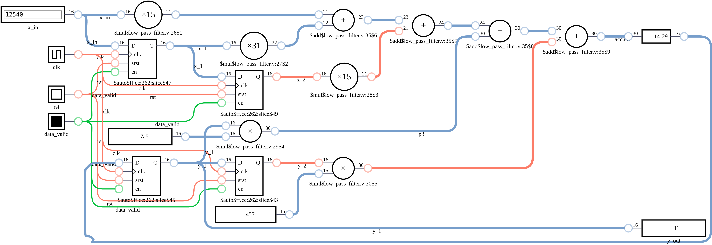
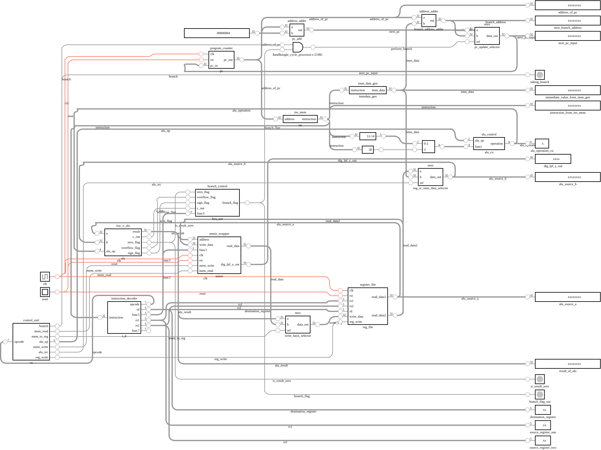
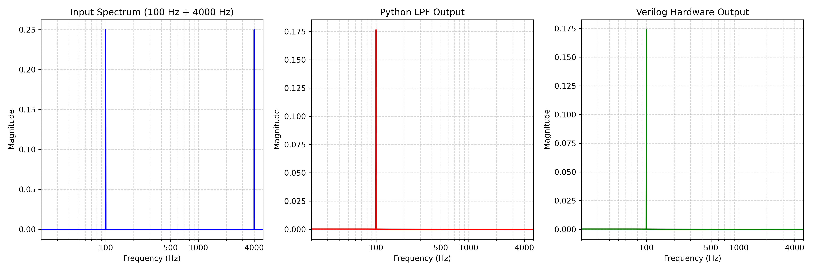
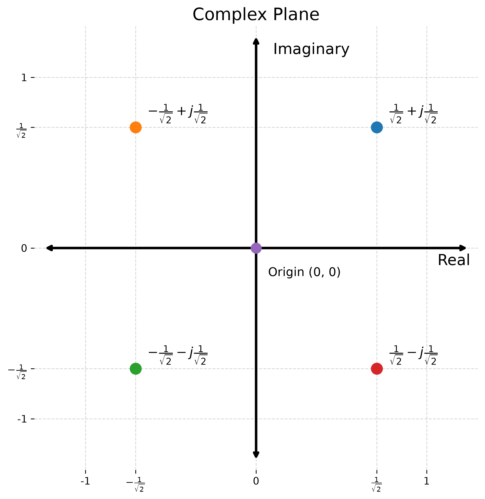
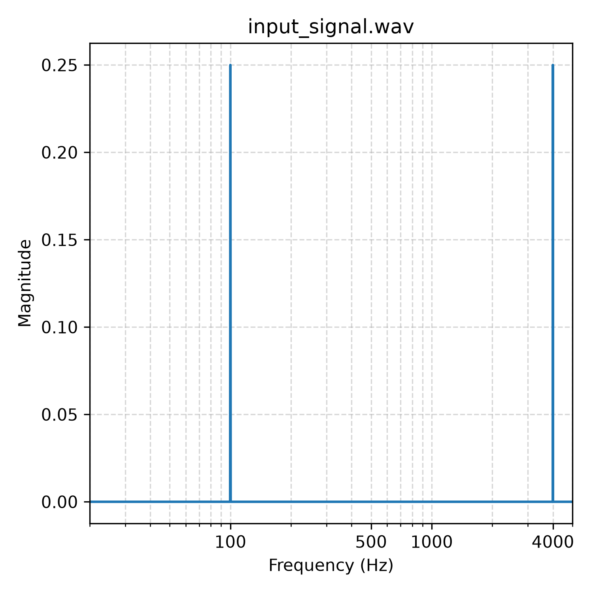
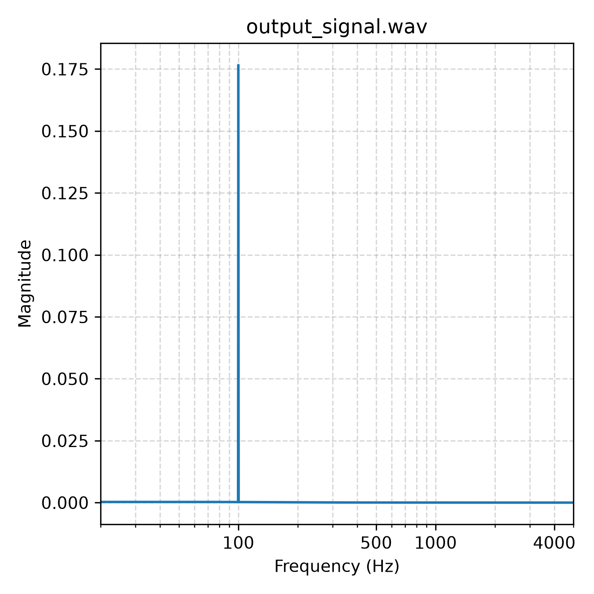
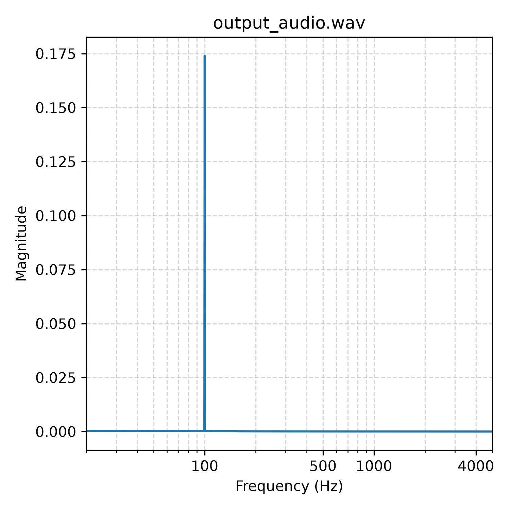

# Index
1. Brief & Working
2. Images and Outputs (to provide summary beforehand)
    - Image output from DigitalJS
3. Construction Of 2nd Order ButterWorth Low Pass Filter
 - Derivation Of 2nd Order Butterworth Low pass filter
    - Starting equation, 
    - Filter Design Problem
    - Bilinear Transformation 7 Z-transform
    - Difference equation
    - Direct Form-I
5. Consturciton of Filter in Verilog
    - Floating Point vs Fixed Point 
    - Mention riscv32I so to work in existing work instead of implementing floating units
    - perofmring conversions etc
    - Show the loss in precision 58.xx vs 56 as output
6. How to use this project for yours, python scripts, /scripts folder
    - Compile & run verilog test bench code
    - Generating audio
    - Converting .wav file to hex file
    - Converting .hex file back to .wav file
    - Plotting frequency spectrum
7. Using LPF With Single Cycle RISCV Processor
3. Perfomance Comparison
    - Instruction Vs Cycle Count Comparison(Yet to include)
x. Imporvements
5. References


# Single Cycle RISC-V Processor (32bit) Integer Subset
- RiscV32 (I) Implementation with Butterworth Second Order Low Pass Filter as Hardware Accelerator being interfaced on Memory Mapped 0x00000000H.
- Processes audio via dedicated accelerator (consisting of parallel adders and multipliers and delay registers) instead of sequential eexcution by processor
- Low Pass Filter Diagram

- RISCV32 Single Cycle Processor Diagram


Note: Few unnecessary wires/regs are being used for output, because simulating on digitaljs
it was harder to see what was the value in different regs eg, alu_output, Program Counter etc.

# Input & Output Demonstration
Note: How to generate audio and test filtering action in verilog and reconstruct audio back, do frequency analysis are all present on Section 6.

The input is a 3-second, 16-bit PCM signal generated with SciPy. It combines
100 Hz and 4,000 Hz sine waves.

**Input signal**
**HEARING WARNING: Contains 4000 Hz Sound**

- **Input Signal (A hum and a tin sound)**

https://github.com/user-attachments/assets/da812555-eda7-4a3b-aa57-20f6f05ca55a

- Output Audio: (Filtering action via python script, before testing in verilog)

https://github.com/user-attachments/assets/1bf2b3b9-f98f-4fc8-accc-5338da5ace6d

- Output Audio via Verilog LPF processing

https://github.com/user-attachments/assets/c2acd90c-50c1-4719-ba5c-3ec40075e909

## Frequency Spectrum Analysis
- The input signal in [audios/input_signal.wav](audios/input_signal.wav) contains two tones: 100 Hz and 4,000 Hz.
- The filtered output in [audios/filtered_lpf_signal.wav](audios/filtered_lpf_signal.wav) keeps only the 100 Hz component, showing the low-pass filter removes the high-frequency tone.
- The processor output in [audios/single_lpf_accelerator_output.wav](audios/single_lpf_accelerator_output.wav) matches this behavior, confirming the hardware implementation works correctly.
- The frequency plot compares the input and filtered spectra side by side. 


# Performance Comparison
- To include soon..


## Designing a 2nd Order Butterworth Low Pass Filter

*   I started with a design problem. I want to design a butterworth low pass filter. I will use two superimposed signals for testing 100Hz and 4000Hz, so my lpf should have cut off frequency at 100Hz. As 1st order may be too weak (The more we increase order, the closer we get to ideal low pass filter). So searching online and suggestion from gemini, I decided to start with 2nd order.
*   If you are just looking for the final equation that can be used quickly in verilog, you can skip the derivation and directly use the difference equation $y[n]$.

---

## Sampling Frequency and Nyquist Theorem Notes

*   **Note on Sampling Frequency:** I am choosing a sampling frequency of $10,000\text{ Hz}$ as suggested by the Nyquist theorem.
*   **Initial Test:** Used a $100\text{ Hz} + 5000\text{ Hz}$ superimposed signal initially. However, perhaps due to hitting the exact Nyquist rate (where the highest frequency component equals half the sampling rate), I heard nothing in the generated audio.
*   Later, I used a $100\text{ Hz} + 4000\text{ Hz}$ sine superimposed signal to stay safely below the Nyquist limit.
*   According to the Nyquist-Shannon sampling theorem, to accurately reconstruct a bandlimited signal without aliasing, the sampling frequency ($f_s$) must be strictly greater than twice the maximum frequency ($f_{\max}$) present in the signal:

$$f_s > 2 f_{\max}$$

*   Higher frequency component in my signal = $4000\text{ Hz}$, so $f_s > 8000\text{ Hz}$ was safe but I chose $10,000\text{ Hz}$.

---

## The Derivation

### 1. Analog Prototype and Pole Selection

A Butterworth filter is defined by having a maximally flat magnitude response in the passband. The magnitude squared response for a normalized analog Butterworth filter ($\Omega_c = 1\text{ rad/s}$) is:

$$|H(j\Omega)|^2 = \frac{1}{1 + \Omega^{2N}}$$

Evaluating the response along the imaginary axis ($\Omega^2 = -s^2$) for an order of $N=2$ yields the s-domain relationship:

$$H(s) \cdot H(-s) = \frac{1}{1 + (-s^2)^2} = \frac{1}{1 + s^4}$$

Set the denominator polynomial to zero ($1 + s^4 = 0$) to locate the system's characteristic poles. Using Euler's identity, $e^{j\theta} = \cos\theta + j\sin\theta$, and noting that $-1 = e^{j(\pi + 2k\pi)}$, we set up the equation for the poles:

$$s^4 = e^{j(\pi + 2k\pi)}$$

Taking the 4th root (raising both sides to the power of $1/4$) divides the exponent's angle by 4:

$$s_k = \left(e^{j(\pi + 2k\pi)}\right)^{1/4} = e^{j\frac{\pi + 2k\pi}{4}} \quad \text{for } k = 0, 1, 2, 3$$

Evaluating this for each $k$ gives our four complex poles:
*   $s_0 = \frac{1}{\sqrt{2}} + j\frac{1}{\sqrt{2}}$
*   $s_1 = -\frac{1}{\sqrt{2}} + j\frac{1}{\sqrt{2}}$
*   $s_2 = -\frac{1}{\sqrt{2}} - j\frac{1}{\sqrt{2}}$
*   $s_3 = \frac{1}{\sqrt{2}} - j\frac{1}{\sqrt{2}}$

#### Plotting the Poles in the s-plane
- 

To ensure system stability, all poles of $H(s)$ must lie strictly in the left-half of the s-plane. Selecting stable poles $s_1$ and $s_2$ allows us to construct the normalized analog transfer function $H_n(s)$:

$$H_n(s) = \frac{1}{(s - s_1)(s - s_2)}$$

Substituting the values of $s_1$ and $s_2$:

$$H_n(s) = \frac{1}{\left[s - \left(-\frac{1}{\sqrt{2}} + j\frac{1}{\sqrt{2}}\right)\right]\left[s - \left(-\frac{1}{\sqrt{2}} - j\frac{1}{\sqrt{2}}\right)\right]}$$

Expanding this difference of squares yields the normalized prototype:

$$H_n(s) = \frac{1}{s^2 + \sqrt{2}s + 1}$$

### Frequency Scaling Beforehand

To scale to the desired cutoff frequency $\Omega_p$, we substitute $s \to \frac{s}{\Omega_p}$. 

$$H_a(s) = \frac{1}{\left(\frac{s}{\Omega_p}\right)^2 + \sqrt{2}\left(\frac{s}{\Omega_p}\right) + 1}$$

Multiplying the numerator and denominator by $\Omega_p^2$ gives:

$$H_a(s) = \frac{\Omega_p^2}{s^2 + \sqrt{2}\Omega_p s + \Omega_p^2}$$

### 2. Frequency Pre-Warping

*(Note: As our end goal is to process audio in a digital/binary system, we are talking about digital frequency here).*

The frequency relationship in the analog <--> digital domain is non-linear, so we need to perform frequency pre-warping. Calculate equivalent analog frequency as per the given digital frequency specs.

$$\Omega_p = \frac{2}{T} \tan\left(\frac{\omega_c}{2}\right)$$

Given our sampling frequency $f_s = 10,000\text{ Hz}$:
*   $T = \frac{1}{f_s} = 10^{-4}\text{ s}$
*   $\omega_c = 2\pi \frac{f_c}{f_s} = 2\pi \frac{100}{10000} = 0.02\pi$

$$\Omega_p = \frac{2}{10^{-4}} \tan\left(\frac{0.02\pi}{2}\right) = 2 \cdot 10^4 \tan(0.01\pi)$$

As equations get dirty if we replace with numerical values, let $K = \frac{2}{T} = 2 \cdot 10^4$. 
So, $\Omega_p = K \tan(0.01\pi)$.

Replacing the value of $\Omega_p$ in the un-normalized transfer function $H_a(s)$ yields:

$$H_a(s) = \frac{K^2 \tan^2(0.01\pi)}{s^2 + \sqrt{2}s K \tan(0.01\pi) + K^2 \tan^2(0.01\pi)}$$

Dividing the numerator and denominator by $K^2 \tan^2(0.01\pi)$ formats it perfectly for the next step:

$$H_a(s) = \frac{1}{\frac{1}{K^2 \tan^2(0.01\pi)}s^2 + \frac{\sqrt{2}}{K\tan(0.01\pi)}s + 1}$$

### 3. Bilinear Transformation (Analog -> Digital)

The Bilinear Transformation maps the analog s-plane to the discrete z-plane using the substitution:
$$s = \frac{2}{T}\left(\frac{1 - z^{-1}}{1 + z^{-1}}\right)$$

As $\frac{2}{T} = 2 \cdot 10^4$, which we have assumed to be $K$ earlier, this becomes:
$$s = K \left( \frac{1 - z^{-1}}{1 + z^{-1}} \right)$$

Now, replace $s$ with $z$ in the analog transfer function $H_a(s)$:

$$H(z) = \frac{1}{\frac{1}{K^2 \tan^2(0.01\pi)} \left[K \left(\frac{1 - z^{-1}}{1 + z^{-1}}\right)\right]^2 + \frac{\sqrt{2}}{K \tan(0.01\pi)} \left[K \left(\frac{1 - z^{-1}}{1 + z^{-1}}\right)\right] + 1}$$

Notice how the $K$ terms completely cancel out algebraically:

$$H(z) = \frac{1}{\frac{K^2}{K^2 \tan^2(0.01\pi)} \left(\frac{1 - z^{-1}}{1 + z^{-1}}\right)^2 + \frac{\sqrt{2}K}{K \tan(0.01\pi)} \left(\frac{1 - z^{-1}}{1 + z^{-1}}\right) + 1}$$

$$H(z) = \frac{1}{\frac{1}{\tan^2(0.01\pi)} \left(\frac{1 - z^{-1}}{1 + z^{-1}}\right)^2 + \frac{\sqrt{2}}{\tan(0.01\pi)} \left(\frac{1 - z^{-1}}{1 + z^{-1}}\right) + 1}$$

Because $\frac{1}{\tan(\theta)} = \cot(\theta)$, we can simplify the equation by letting $A = \cot(0.01\pi) \approx 31.820516$. We can represent the transfer function again as:

$$H(z) = \frac{1}{A^2 \left[ \frac{1 - z^{-1}}{1 + z^{-1}} \right]^2 + \sqrt{2} A \left[ \frac{1 - z^{-1}}{1 + z^{-1}} \right] + 1}$$

Multiplying the numerator and denominator by $(1 + z^{-1})^2$ gives:

$$H(z) = \frac{(1 + z^{-1})^2}{A^2(1 - z^{-1})^2 + \sqrt{2}A(1 - z^{-1})(1 + z^{-1}) + (1 + z^{-1})^2}$$

Expanding the binomials in the denominator and grouping by powers of $z$ produces the structured transfer function:

$$H(z) = \frac{1 + 2z^{-1} + z^{-2}}{(A^2 + \sqrt{2}A + 1) + 2(1 - A^2)z^{-1} + (A^2 - \sqrt{2}A + 1)z^{-2}}$$

### 4. Transfer Function & Difference Equation

To map this to standard Biquad form, we divide all terms by the constant denominator factor $D_0 = (A^2 + \sqrt{2}A + 1)$ to normalize $a_0$ to $1$. We need to map the transfer function as:

$$H(z) = \frac{Y(z)}{X(z)} = \frac{b_0 + b_1 z^{-1} + b_2 z^{-2}}{1 + a_1 z^{-1} + a_2 z^{-2}}$$

Using $A = \cot(0.01 \pi) = 31.820516$, the constants resolve to:

*   **$A^2$** $= 1012.5452$
*   **$\sqrt{2}A$** $= 45.0010$
*   **$D_0$** $= A^2 + \sqrt{2}A + 1 = 1058.5462$
*   **$z^{-1}$ numerator ($D_1$)** $= 2(1 - A^2) = -2023.0904$
*   **$z^{-2}$ numerator ($D_2$)** $= A^2 - \sqrt{2}A + 1 = 968.5442$

Dividing by $D_0$ gives the final filter coefficients:

*   $b_0 = \frac{1}{1058.5462} = 0.00094469$
*   $b_1 = \frac{2}{1058.5462} = 0.00188932$
*   $b_2 = \frac{1}{1058.5462} = 0.00094469$
*   $a_1 = \frac{-2023.0904}{1058.5462} = -1.911197$
*   $a_2 = \frac{968.5442}{1058.5462} = 0.914975$

Now, applying the Inverse Z-Transform directly to $H(z)$ extracts the time-domain difference equation (Direct Form I) for hardware implementation:

*(Note: I am not replacing coefficients here as it will be dirty, but they remain as variables ready for hardware)*

$$Y(z) [1 + a_1 z^{-1} + a_2 z^{-2}] = X(z) [b_0 + b_1 z^{-1} + b_2 z^{-2}]$$

$$y[n] + a_1 y[n-1] + a_2 y[n-2] = b_0 x[n] + b_1 x[n-1] + b_2 x[n-2]$$

$$y[n] = b_0 x[n] + b_1 x[n-1] + b_2 x[n-2] - a_1 y[n-1] - a_2 y[n-2]$$

### 5. Direct Form - I representation
- 

### 5. Floating Point Coefficients To Fixed Point Conversion

Because our processor implements a subset of the RV32I base integer instruction set, it lacks native floating-point hardware support. To solve this, we will use fixed-point numbers.

Checking the filter coefficients, we observe the following extremes:
*   **Maximum positive value:** $+0.914975$
*   **Maximum negative value:** $-1.911197$

To represent these in a 16-bit register, a Q2.14 fixed-point format is sufficient.
A signed Q2.14 format consists of 1 sign bit, 1 integer bit, and 14 fractional bits. This provides a representable range from a minimum of $-2.0$ (binary `10.0000 0000 0000 00`) to a maximum of $+1.99993896...$ (binary `01.1111 1111 1111 11`). Since our coefficients strictly fall within the $[-2.0, +1.9999]$ boundary, this format perfectly covers our required range without overflow.

*   **Precision (Step Size):** $2^{-14} = \frac{1}{16384} \approx 0.000061035$
    *(Yes, the smallest non-zero number we can represent is exactly the step size between any two consecutive representable numbers).*

To convert a coefficient to this integer format, we multiply by the scaling factor $2^{14} = 16384$. We are essentially finding how many LSB steps of size $\frac{1}{16384}$ are needed to build the target value. For example, building $0.914975$:

$$
\mathrm{Count} = \dfrac{\mathrm{Target Value}}{\mathrm{LSB Step Size}} = \dfrac{0.914975}{2^{-14}} = 0.914975 \cdot 16384 \approx 14991
$$


$14991$ in decimal corresponds to Q2.14 binary `00.11101010001111`. When reconstructed, $\frac{14991}{16384} = 0.9149780273$. Note that the reconstructed value is slightly greater because we rounded $14990.95$ to $14991$. We must understand that fixed-point representation may not be exact due to quantization error. When designing filters, we must ensure the quantized coefficients still produce a stable response, otherwise, the filter may oscillate or fail entirely.

Multiplying each coefficient by $2^{14} = 16384$ and rounding yields:
*   $b_0 = 0.00094469 \times 16384 \approx 15$
*   $b_1 = 0.00188938 \times 16384 \approx 31$
*   $b_2 = 0.00094469 \times 16384 \approx 15$
*   $a_1 = -1.911197 \times 16384 \approx -31313$
*   $a_2 = 0.914976 \times 16384 \approx 14991$

Our difference equation requires subtracting the feedback terms: $-a_1 y[n-1] - a_2 y[n-2]$. To optimize our hardware and use a pure adder tree, we can convert these coefficients beforehand by storing their negated (2's complement) forms. This eliminates subtraction operations in Verilog.

*   **For $-a_1$:** $-(-31313) = +31313$. No 2's complement conversion needed, store directly as positive.
*   **For $-a_2$:** $-(+14991) = -14991$. Convert into 16-bit 2's complement:
    * `1100 0101 0111 0001`

```verilog
    localparam signed [15:0] b0 = 16'sb0000000000001111; // 15
    localparam signed [15:0] b1 = 16'sb0000000000011111; // 31
    localparam signed [15:0] b2 = 16'sb0000000000001111; // 15
    localparam signed [15:0] a1 = 16'sb0111101001010001; // 31313  (-(-a1))
    localparam signed [15:0] a2 = 16'sb1100010101110001; // -14991 (-(+a2))

```

Up to here is the mathematical theory. Now we just write Verilog code to perform pure addition.
Check code here: `verilog_modules/low_pass_filter.v`

```verilog
module low_pass_filter(
    // 16 bit input
    // We assume we save the audio in 16 bit signed int notation in the wav file
    input signed [15:0] x_in,
    input rst,
    input wire data_valid,
    input wire clk,
    output reg signed [15:0] y_out
);

    // Pre-negated feedback coefficients in Q2.14 format
    localparam signed [15:0] b0 = 16'sb0000000000001111; // 15
    localparam signed [15:0] b1 = 16'sb0000000000011111; // 31
    localparam signed [15:0] b2 = 16'sb0000000000001111; // 15
    localparam signed [15:0] a1 = 16'sb0111101001010001; // +31313 (c1 = -a1)
    localparam signed [15:0] a2 = 16'sb1100010101110001; // -14991 (c2 = -a2)

    // Delay registers x & y
    reg signed [15:0] x_1;
    reg signed [15:0] x_2;
    reg signed [15:0] y_1;
    reg signed [15:0] y_2;

    // Multipliers for the filter taps
    wire signed [31:0] p0 = x_in * b0;
    wire signed [31:0] p1 = x_1  * b1;
    wire signed [31:0] p2 = x_2  * b2;
    wire signed [31:0] p3 = y_1  * a1;
    wire signed [31:0] p4 = y_2  * a2;

    // Addition may scale the output > 32 bit so take 3 guard bits
    // Because we pre-negated the feedback coefficients, we use a pure adder tree:
    wire signed [34:0] accum = p0 + p1 + p2 + p3 + p4;

    // Shift right by 14 (remove Q2.14 scale) and take lower 16 bits
    wire signed [34:0] shifted_accum = accum >>> 14;

    always @(posedge clk) begin
        if (rst) begin
            // initialize everything to 0 in beginning
            x_1 <= 0;
            x_2 <= 0;
            y_1 <= 0;
            y_2 <= 0;
            y_out <= 0;

        // only process if a valid x_in is provided as input
        end else if (data_valid) begin
            x_2 <= x_1;
            x_1 <= x_in;
            y_2 <= y_1;
            y_1 <= shifted_accum[15:0];
            y_out <= shifted_accum[15:0];
        end
    end
endmodule

```

As we do not want to complicate our system using DMA, we use the Memory Mapped IO (MMIO) concept to place the LPF accelerator into the `0x00000000H` address space for simplicity.

Please check: `single_cycle_risc/mmio_wrapper.v`

Find the test benches for the low pass filter, MMIO wrapper, and single-cycle processor combining everything here.

*Note: The primary purpose of this guide is not to build the single-cycle processor or RISC-V processor from scratch, but everything will be included in the reference section.*

## How to Test the Hardware

This section explains how I tested the hardware created in this project.

### Requirements

You need to have Python installed. You can create a virtual environment and
install the required packages:

```bash
python -m venv .venv
source .venv/bin/activate
pip install -r requirements.txt
```

If you already have `uv` installed, you can use it instead. If not, you can
install it from the [uv installation guide](https://docs.astral.sh/uv/getting-started/installation/):

```bash
uv sync
```

Please note that the input and output filenames are defined inside the Python
scripts and Verilog test benches. Check and modify those filenames when needed.

### 1. Generate a Test Input

Create a 16-bit PCM test signal containing 100 Hz and 4,000 Hz tones:

```bash
python scripts/generate_audio.py
```
Output
```bash
Successfully generated 'input_signal.wav' with frequencies: [100, 4000]
```

To check its frequency spectrum using the Fast Fourier Transform, modify
`scripts/freq_spec.py`:

```python
DEFAULT_INPUT_AUDIOS = [
    "input_signal.wav",
]
```

Then run:

```bash
python scripts/freq_spec.py
```
Output:
```bash
Plot successfully saved to freq_spec_input_signal.png
```



### 2. Test the Filter in Python

Before testing the filter in Verilog, test the difference equation and the
coefficients obtained during the derivation. This performs the low-pass
filtering in Python and generates an output WAV file:

```bash
python scripts/digital_lpf.py
```
output
```bash
Successfully saved filtered audio to 'output_signal.wav'
```

Update `scripts/freq_spec.py` to use the generated file:

```python
DEFAULT_INPUT_AUDIOS = [
    "output_signal.wav",
]
```

Then run:

```bash
python scripts/freq_spec.py
```
Output:

```bash
Plot successfully saved to freq_spec_output_signal.png
```



### 3. Convert the Audio to Hexadecimal

Convert the generated WAV file to a hexadecimal file that can be read by the
Verilog test bench:

```bash
python scripts/wav_to_hex.py
```
Output:
```bash
Successfully exported 30000 samples to 'audio_in.hex'.
```

This generates `audio_in.hex`.

### 4. Add the Input to the Verilog Test Bench

The filenames are assumed to be
relative to the project root, and the output file is also generated there.

The input file is loaded with:

```verilog
$readmemh("audio_in.hex", audio_mem);
```

The output filename is set with:

```verilog
file_out = $fopen("audio_out.hex", "w");
```

### 5. Run the Verilog Test Bench

I created `runner.py` to find the Verilog modules recursively. This avoids
having to list every module manually, for example:

```bash
iverilog -o something.vvp a.v b.v c.v
```

The `-i` option specifies the input test bench, and the `-d` option specifies
the directory containing the Verilog modules. Run the low-pass filter test
bench with:

```bash
python scripts/runner.py -i test_bench/tb_low_pass_filter.v -d verilog_modules
```
This will produce ```audio_out.hex```


### 6. Convert the Verilog Output Back to WAV

Convert the generated hexadecimal output file back into a WAV file:

```bash
python scripts/hex_to_wav.py
```
Output:
```
Successfully converted 30000 samples to 'output_audio.wav'.
```

### 7. Check the Filtered Output

To check the frequency spectrum of the Verilog output, update
`scripts/freq_spec.py`:

```python
DEFAULT_INPUT_AUDIOS = [
    "output_audio.wav",
]
```

Then run:

```bash
python scripts/freq_spec.py
```



Listen to the output audio and check its frequency spectrum to confirm that
the high-frequency component has been removed.

8. Further Imporvements
- Direct Form I -> Direct Form II COnversion
- Combining multiple biquad elements to perform complex (n order filtering)
- Processor provides/calculates the filter coefficients instead of hardcoding them inside verilog module

# References
1. Billinear Transofmration 
- https://www.youtube.com/watch?v=JFQMoVd53Hw&list=LL&index=4&t=175s&pp=iAQBsAgC
2. Frequency Prewraping 
- https://www.youtube.com/watch?v=XtelHVBUAMo&list=LL&index=5&t=245s&pp=iAQBsAgC
3. RISCV 32 Card | Instructions Opcode (Very important)
- https://www.cs.sfu.ca/~ashriram/Courses/CS295/assets/notebooks/RISCV/RISCV_GREEN_CARD.pdf
3. Computer Architecture / Processor Design (RISCV)
- https://www.youtube.com/watch?v=deuti8hWkeE&list=PLq5K7Zq6zbGO2OO7Y9a7h0iEWK5gDYw_q
2. Fixed point numbers
- https://www.geeksforgeeks.org/computer-organization-architecture/fixed-point-representation/
https://youtu.be/zVM8NKXsboA
- https://en.wikipedia.org/wiki/Q_(number_format)


4. Loading files into memory in verilog
- https://projectf.io/posts/initialize-memory-in-verilog/#:~:text=Verilog%20allows%20you%20to%20initialize%20memory%20from,file%20containing%20binary%20values%20separated%20by%20whitespace.

5. Direct Form i represnetaiton
- https://ccrma.stanford.edu/~jos/fp/img76_2x.png
